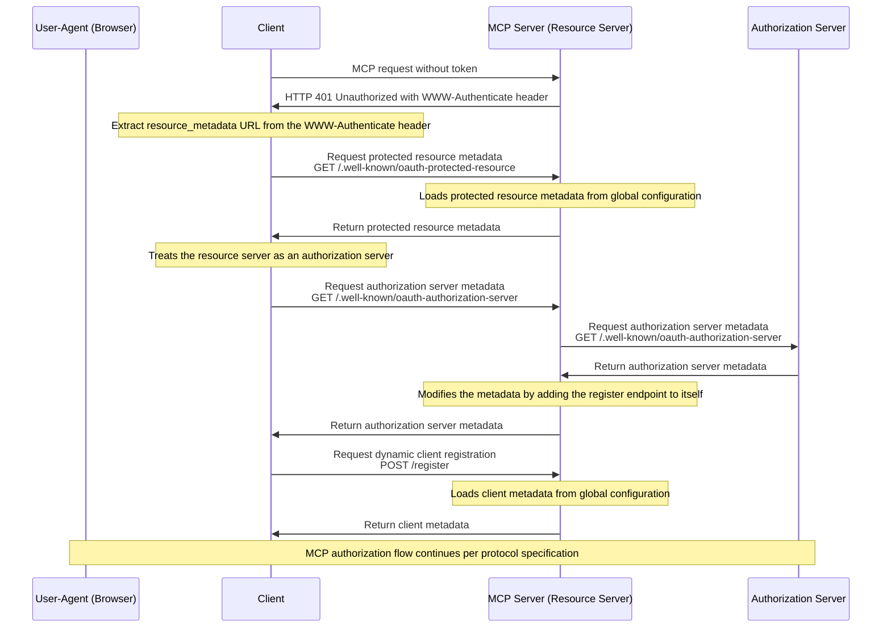

# OAuth

This document describes how the DocSpace MCP server implements OAuth
authorization with dynamic client registration proxying.

## Contents

- [Limitation](#limitation)
- [Authorization Flow](#authorization-flow)
- [References](#references)

## Limitation

The DocSpace authorization server does not support
[RFC 7591: Dynamic Client Registration Protocol]. To work around this
limitation, the DocSpace MCP server proxies dynamic client registration requests
and returns pre-configured OAuth client metadata instead of creating new
applications. As a result, all MCP clients are forced to use the same OAuth
application configured in the global configuration.

## Authorization Flow

The complete authorization flow with the proxying adaptation:

## References

- [RFC 7591: Dynamic Client Registration Protocol]
- [MCP: Authorization]
- [DocSpace MCP: Global Configuration]
- [DocSpace MCP: Authentication Resolution]

<!-- Footnotes -->

[RFC 7591: Dynamic Client Registration Protocol]: https://www.rfc-editor.org/rfc/rfc7591
[MCP: Authorization]: https://modelcontextprotocol.io/specification/2025-06-18/basic/authorization/

[DocSpace MCP: Global Configuration]: ../configuration/global-configuration.md
[DocSpace MCP: Authentication Resolution]: ../configuration/authentication-resolution.md
